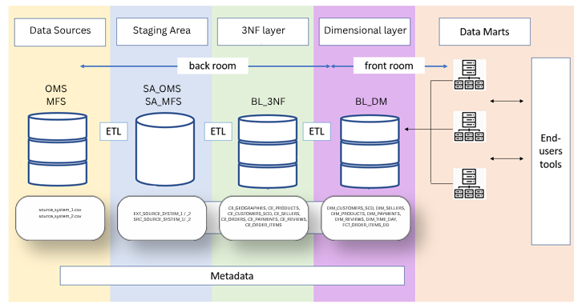
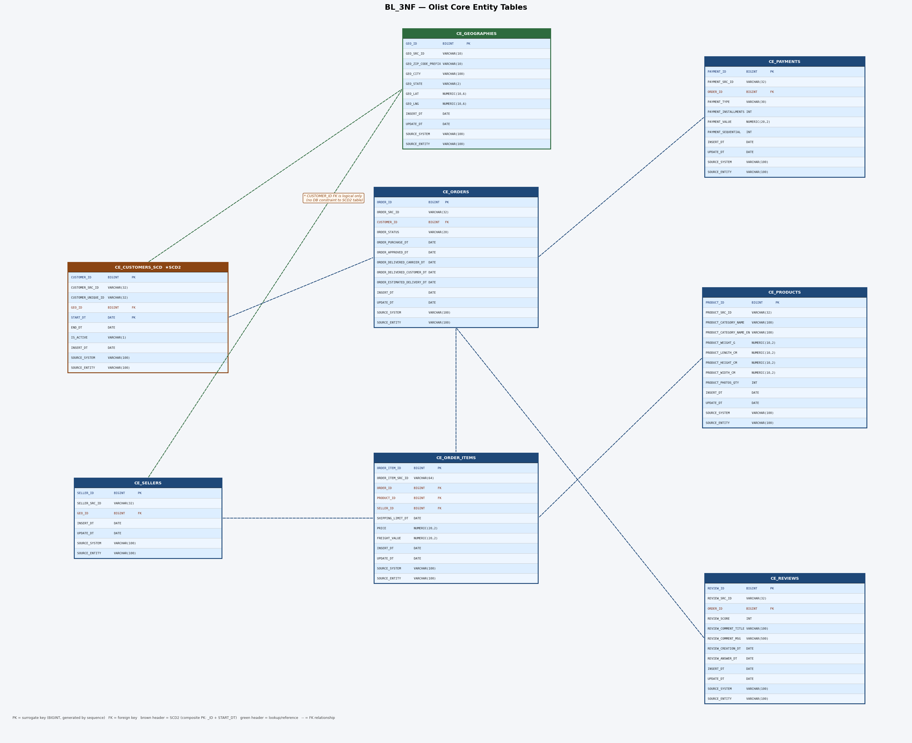
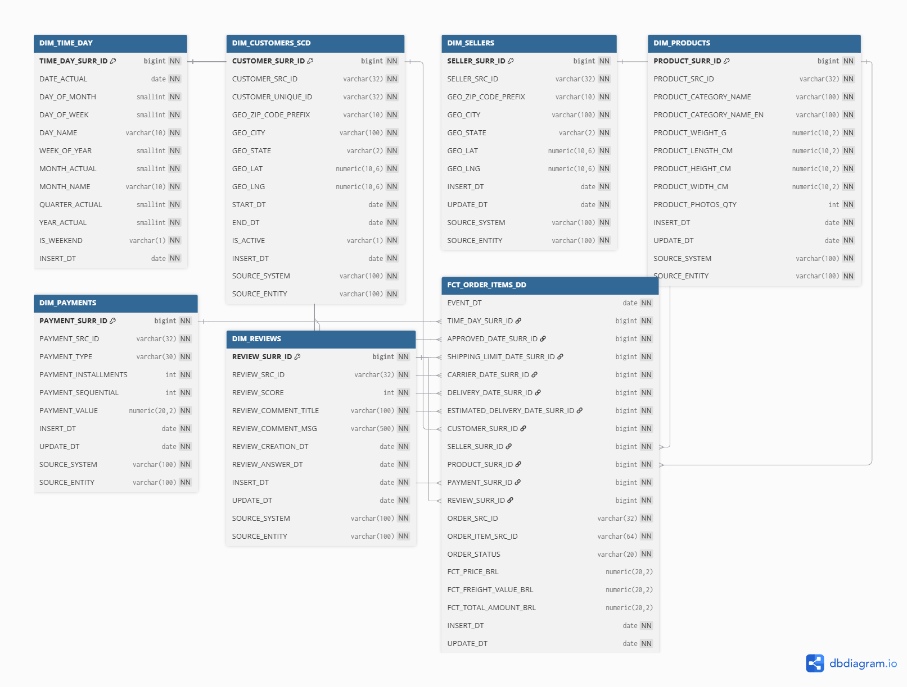
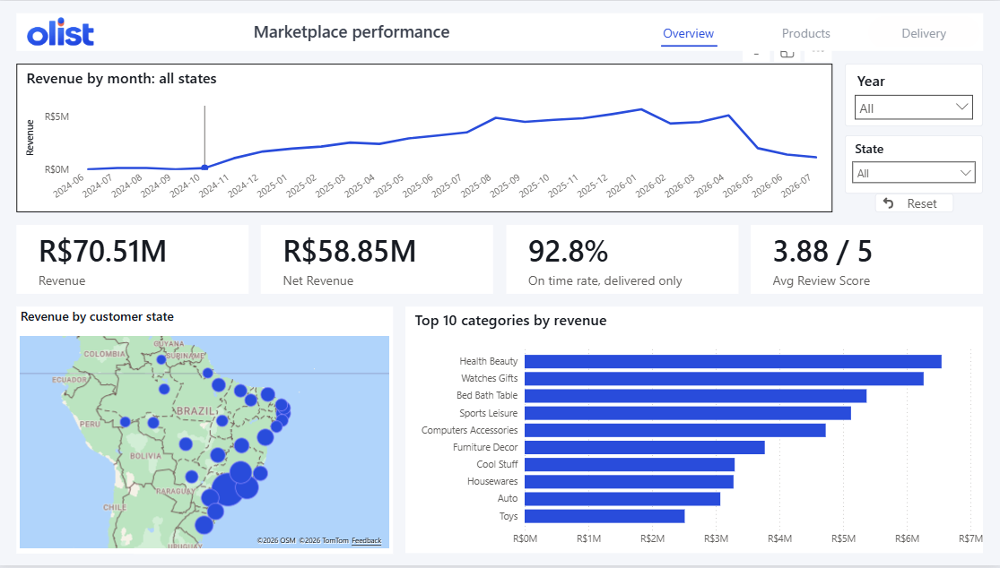
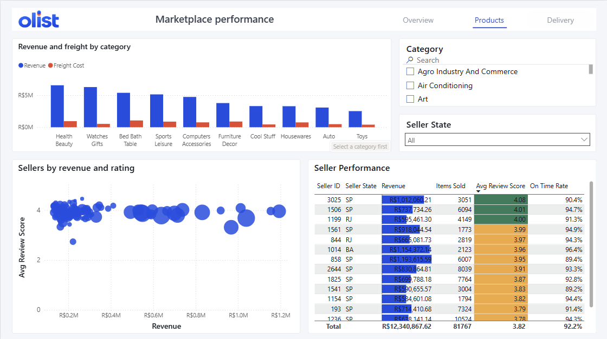
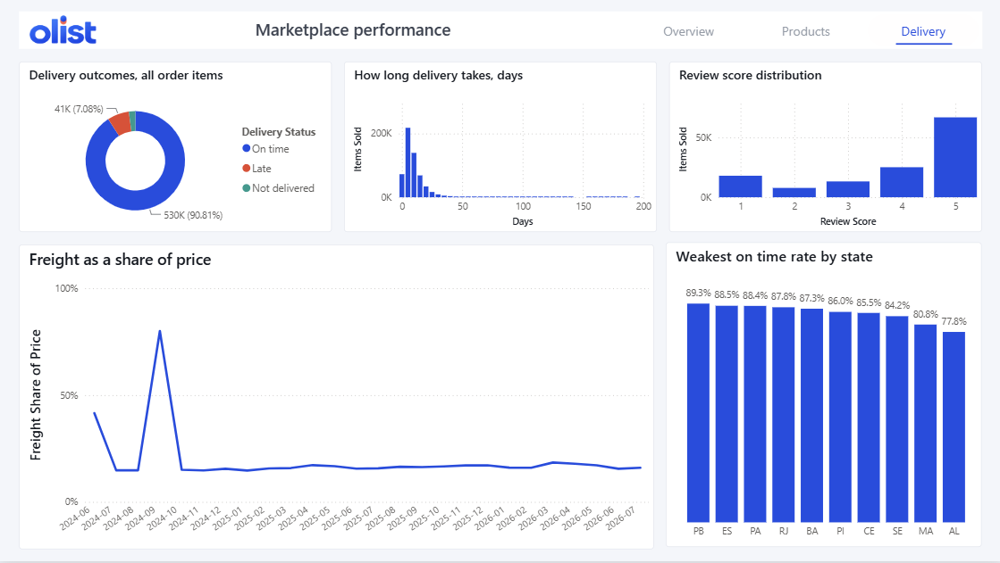
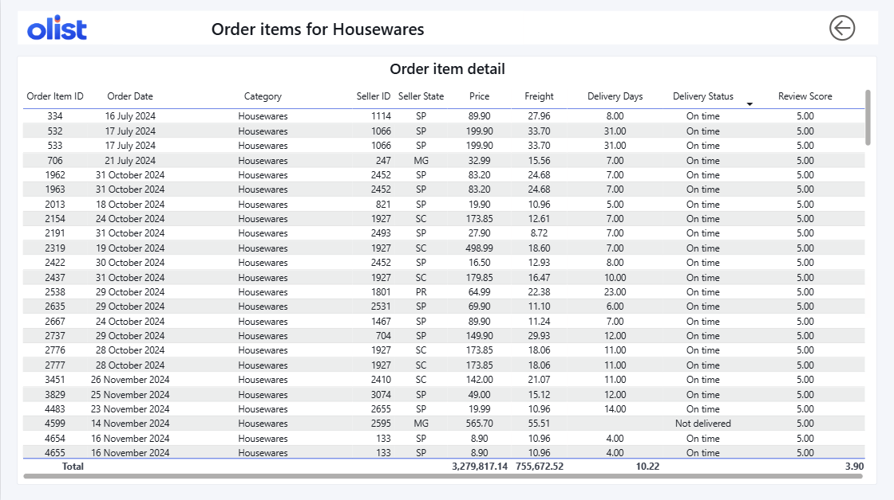
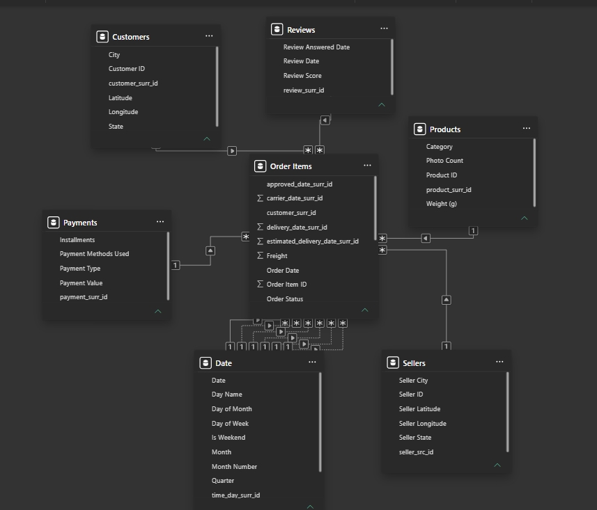
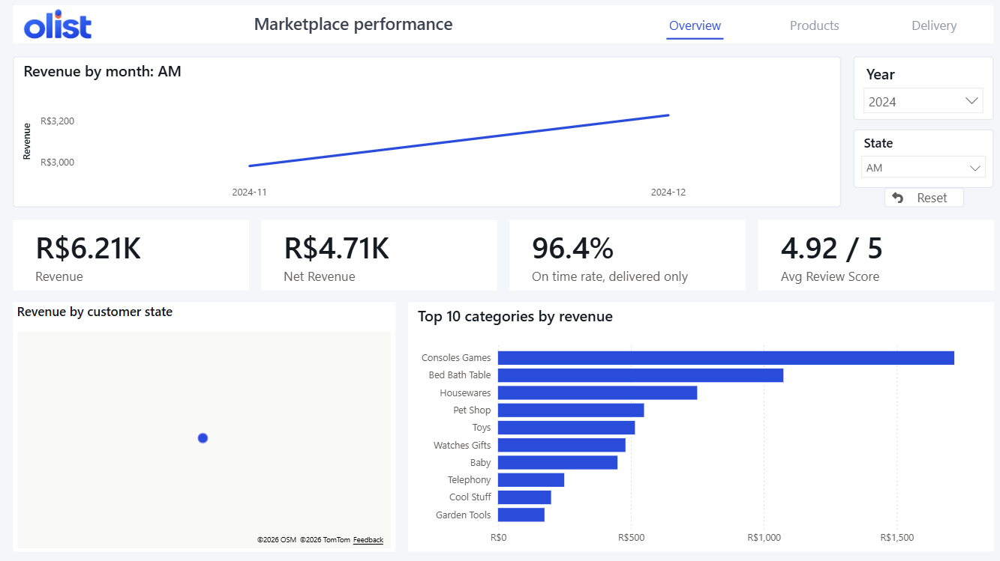
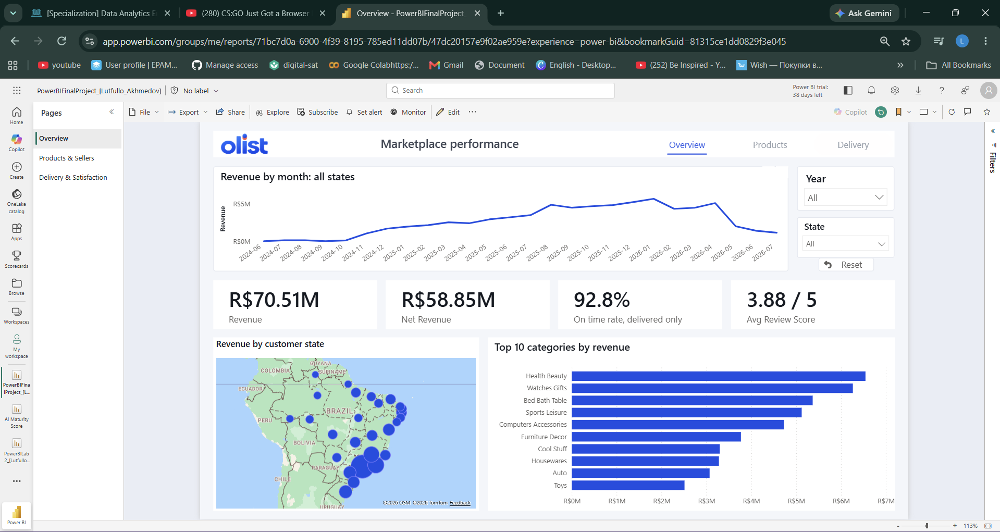

# Olist Marketplace Analytics

A Power BI report built on a PostgreSQL data warehouse I designed, modelled and loaded myself,
covering 25 months of activity on a Brazilian e-commerce marketplace.

**[Open the live report](https://app.powerbi.com/view?r=eyJrIjoiNGYzMTZjMDgtNWU1Mi00N2Y4LTlmODEtYzVlZGFmZTUyNDk4IiwidCI6ImZhYjhhYzI0LTA5ZmUtNGRjMS04N2ViLTE2MzNhNjZhOGFlOCIsImMiOjEwfQ%3D%3D&pageName=47dc20157e9f02ae959e)** and click through it yourself. No sign-in needed.

Prefer to watch? There is a [short walkthrough](walkthrough.mp4) of the report in this repo.

Two source files carrying 1,126,500 rows between them go in. A 583,250 row fact table comes out.

The dashboard is the visible half. Underneath it sits a full pipeline: two source systems landing in
a staging area, cleansed into a 3NF core, published as a star schema, and only then read by Power BI.

> **Portfolio exercise.** Built on the public Olist Brazilian e-commerce dataset from Kaggle.
> Not affiliated with, endorsed by, or produced for Olist. The company name and mark appear only
> because the dataset is theirs, and inventing a different name would misrepresent where the data
> came from.

---

## The warehouse underneath



Four layers, with the back room and front room separated deliberately. The staging area is a raw
buffer where every column is text and nothing is cast, because an earlier version that cast types on
the way in was rejected on review. Cleansing and conforming happen in the 3NF core, and only the
dimensional layer is exposed to a reporting tool.

| | |
|---|---|
| Source records | 1,126,500 across two systems |
| Fact rows | 583,250 at order-item grain |
| Period | 18 June 2024 to 25 July 2026 |
| Customers | 98,670, slowly changing type 2 |
| Sellers | 3,096 |
| Products | 32,952 |
| Reviews | 117,403 |
| Fact partitioning | range, one partition per month |
| ETL | stored procedures, one master procedure runs the chain in dependency order |

### 3NF core



Seven core entity tables plus order items. Surrogate keys come from per-table sequences and the
business key is kept alongside as `*_SRC_ID`. Customers are the one SCD2 table, with a composite key
of id and start date.

There are no NULLs anywhere in the core by design. Unresolved references become a `-1` default
member, missing text becomes `n.a.` and missing dates become `1900-01-01`. That makes every join
resolve, and it is also why the Power BI load has to filter those rows back out again.

### Dimensional layer



Look at `FCT_ORDER_ITEMS_DD`. It carries **six foreign keys into the same date dimension**: purchase,
approval, shipping limit, carrier handover, delivery, and the delivery date originally estimated.

Eleven relationships come out of this in Power BI, six of them into that one date dimension.
That single design choice drives most of the DAX further down this page.

Data flow diagrams for each stage, in Gane/Sarson notation, are in
[images/warehouse](images/warehouse): staging, 3NF load, dimension load and fact load.

---

## The report

Three pages for the reader, two hidden ones doing work behind them.

### Overview



Monthly revenue leads, because the first question anyone asks is whether the business is growing.
Four cards sit underneath, chosen so money and service appear side by side. A report showing only
revenue lets a manager conclude everything is fine while delivery performance quietly slips.

The line drops at the final point because the data stops on 25 July 2026, so that month is about two
thirds complete. It is left in rather than trimmed.

### Products and sellers



Revenue and freight are plotted side by side per category, so the freight bite shows up per category
instead of being buried in one total. The scatter puts every seller on revenue against average review
score, with bubble size showing volume.

Ratings converge as revenue grows. The interesting cases are the exceptions: a seller carrying over a
million reais at a 3.3 average is a commercial problem, because the volume means a lot of customers
had that experience.

### Delivery and satisfaction



Delivery outcomes, how long delivery actually takes, how reviews are distributed, freight as a share
of price over time, and the ten weakest states for on-time delivery.

The delivery-time histogram keeps its full tail out past 150 days. Cutting the axis at 60 would make
a tidier chart and would hide the fact that those orders exist.

### Drillthrough to order detail



Right-clicking any category or seller opens a hidden detail page carrying that filter, with a heading
naming whatever was drilled into.

---

## How Power BI sees the mart



The same star as the ERD above, loaded in Import mode. The six dashed lines into the date table are
those six date foreign keys.

Power BI allows one active relationship per path between two tables, so five of the six are inactive.
Purchase date is the active one, because that is the date the business thinks in when it asks what
was sold in a month. The other five are reached through `USERELATIONSHIP` inside a measure when a
specific question needs them, which is also why the calculated columns use `LOOKUPVALUE` rather than
`RELATED`.

Full breakdown in [dax/measures.md](dax/measures.md), including two bugs worth reading: a measure
that silently ignored its filter, and a peak-marker measure that broke twice for different reasons.

---

## What the report shows

**Freight is 16.5 per cent of revenue.** R$11.66M of R$70.51M gross goes on shipping, which is why
net revenue sits next to gross on the overview page rather than being left to be inferred.

**Alagoas is the outlier worth acting on.** R$410K of revenue at a 77.8 per cent on-time rate and a
3.59 average review, against 92.8 per cent and 3.88 nationally. A revenue-only report would show a
small, unremarkable state.

**Reviews are J-shaped.** The warehouse holds 117,403 reviews against 583,250 order items, so most items carry none. Among those that do, fives dominate, ones are the second largest group, and the middle is thin.
People who are delighted and people who are angry both write reviews; everyone in between mostly does
not.

**Roughly 12,000 of the 583,250 order items never arrived at all.** They are excluded from the on-time rate, because
an order still in transit is neither on time nor late, and counting it would drag the percentage down
for a reason unrelated to delivery performance.

---

## Design rationale

A dashboard is an argument, not a container. Everything below was decided rather than defaulted.

### Push the work upstream

The further back a calculation happens, the less the report has to do while somebody is looking at it.

The date dimension is generated in the warehouse with every attribute already present: day name,
week, month name and number, quarter, year, weekend flag. Power BI never derives a month from a
date at query time, because the column already exists. The star is pre-joined, the keys are narrow
integers, and the `-1` handling means no join returns an unexpected blank.

Inside the model the same logic decides between a calculated column and a measure. A value that is
fixed for a row is a column: `Delivery Days` and `Delivery Status` are computed once at refresh and
compressed alongside the rest of the table. A value that depends on what the reader has selected has
to be a measure, because it cannot be known until the click happens.

Getting that split wrong is the usual reason a report feels sluggish. Columns cost memory once;
measures cost time on every interaction, and a measure that scans a fact table for something a column
could have stored is paying that cost repeatedly for no reason.

Power Query does real work before any of that. PostgreSQL exposes a navigation column for every
foreign key it finds, and since the fact is split across roughly 28 monthly partitions that each carry their
own keys, the date dimension arrived with 182 columns against its real 14. Stripping those, the ETL
lineage columns and the `-1` default members brought the whole model down to 55 columns across seven
tables. Nothing loads that no visual reads.

Two model decisions did most of the work for responsiveness. Filters are single-direction everywhere,
so the engine never has to resolve an ambiguous path. And the highest-cardinality column in the
warehouse, a 500-character review comment that is close to unique on every one of 117,403 rows, was
dropped at load: columnar compression works on distinct value counts, so free text is the most
expensive thing you can carry and no visual here reads it.

### Hierarchy: size carries the argument

Size is read before anything else, and faster than reading. Colin Ware's work on preattentive
processing is the usual reference for this: certain visual properties, size and position among them,
are resolved by the visual system before conscious attention arrives. Whatever is biggest is
therefore claiming to be most important, whether or not that was intended.

So the largest object on each page is the page's actual question.

On Overview that is the revenue trend, running nearly the full width. Growth is the first thing
anyone asks about, so it gets the space and the top position, where Nielsen Norman Group's
eye-tracking work on F-shaped reading puts the first fixation.

Beneath it, four cards sit at equal size, because they are genuinely equal: none of revenue, net
revenue, on-time rate or review score outranks the others, and making one larger would assert a
priority that does not exist. Equal weight, equal width.

Down on the Delivery page, the bottom row is deliberately unequal, roughly two thirds against one third. A
25-month time series needs horizontal room before it is legible at all; ten bars do not. Splitting
that row evenly would have made the more informative visual harder to read in exchange for a tidier
grid. The layout serves the reading, not the other way round.

### Space is a system, not a series of decisions

There is one outer margin and one gap, used everywhere.

That is the whole rule, and its value is not that the numbers are special. It is that nothing is
decided twice. When every gutter is the same, edges line up on their own, and the eye reads
neighbouring visuals as belonging together. That is the Gestalt principle of proximity doing the
work: elements close to each other are perceived as a group, and a consistent gap is what makes the
grouping legible instead of accidental.

Eyeballing each gap produces a layout where nothing is quite wrong and nothing quite lines up. A
single unit removes the judgement call entirely, which is the sense in which layout is arithmetic:
not that particular measurements are correct, but that consistency is checkable and taste is not.

### Less is more

Every feature in this report earns its place by answering a question. The things left out were left
out on purpose:

no gradients, no drop shadows, no decorative icons, no second accent colour, no chart type chosen
for variety, no KPI that nobody asked for.

Conditional formatting uses three fixed thresholds rather than a colour gradient. A gradient looks
smoother and says only that darker is more; a rule says below 3 is a problem and 4 and above is
healthy, which is something a manager can act on.

Tufte's data-ink ratio is the underlying idea. Every mark that is not carrying information is
competing with the marks that are. Restraint is not a style here, it is what keeps a page with eleven
visuals on it readable.

### How the pages tell a story

Page order is a narrative rather than a menu.

**Overview** asks whether the business is healthy. **Products and sellers** asks where the money is
coming from and who is bringing it. **Delivery and satisfaction** asks whether the promises made to
get that money are being kept.

That sequence moves from outcome to cause. Stop after page one and you still have a complete answer
at the level you asked for; one who continues gets progressively more specific, and the
drillthrough page underneath sits at the bottom of that funnel for anyone who wants the individual
rows.

Hierarchy and space are what make that order legible without instructions. Size names the question, position sets the reading order, and consistent gaps say which things belong
together. A reader should be able to work out what a page is about before reading a single label.

### What this draws on

- Edward Tufte, *The Visual Display of Quantitative Information* (1983). Data-ink ratio and the case for removing non-informative marks
- Colin Ware, *Information Visualization: Perception for Design*. Preattentive attributes, why size and position are read before labels
- Stephen Few, *Information Dashboard Design* (2006). Dashboards as single-screen monitoring rather than decoration
- Max Wertheimer and the Gestalt school (1923). Proximity and common region, why consistent spacing reads as grouping
- Nielsen Norman Group, *F-Shaped Pattern for Reading Web Content* (2006). Where attention lands first on a dense page

---

## Techniques used

| | |
|---|---|
| Role-playing dimensions | six date keys, one active, `USERELATIONSHIP` for the rest |
| Calculated columns | 5, including delivery duration and on-time classification |
| Measures | 14, in a dedicated `_Measure` table |
| Dynamic titles | chart title follows whatever state filter is applied |
| Drillthrough | hidden detail page, filtered by category or seller |
| Report page tooltip | hover a state on the map for a small dashboard about it |
| Conditional formatting | rules-based thresholds, not a gradient |
| Bookmarks | reset-filters control, Data captured and Display ignored |



Published to the Power BI Service:



---

## Repo contents

```
images/                   report screenshots
images/warehouse/         architecture, ERDs and data flow diagrams
dax/measures.md           every measure and calculated column, with the reasoning
theme/                    the report theme as JSON
OlistMarketplaceAnalytics.pbix
```

The `.pbix` is included for completeness. It will not refresh without the PostgreSQL warehouse behind
it, but the model, the DAX and the report layout are all inspectable.

---

## Stack

PostgreSQL 17 · Power Query (M) · DAX · Power BI Desktop and Service

## Credits

Built during the EPAM Data Analytics Engineering training programme.


Data derived from the [Brazilian E-Commerce Public Dataset by Olist](https://www.kaggle.com/datasets/olistbr/brazilian-ecommerce)
on Kaggle, expanded across two synthetic source systems for the warehouse build.
